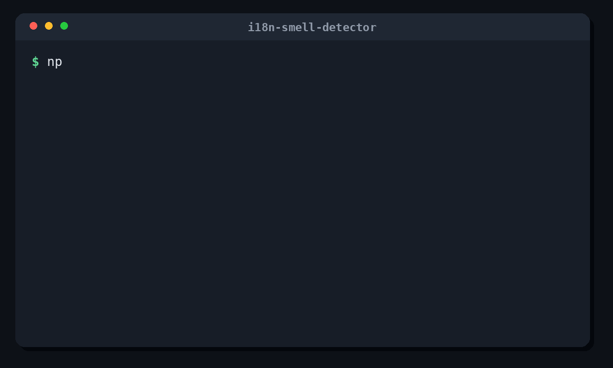

# i18n-smell-detector

[](https://www.npmjs.com/package/i18n-smell-detector)
[](https://github.com/xue-moe/i18n-smell-detector/actions/workflows/ci.yml)
[](https://badge.socket.dev/npm/package/i18n-smell-detector)
[](./LICENSE)

## Catch localization bugs your i18n coverage reports can't see.

`i18n-smell-detector` is an i18n linter that catches localization mistakes ordinary key-coverage checks miss:

- copied base-locale values that were never translated;
- missing, extra, or repeated placeholders;
- hardcoded user-visible text in Vue, JavaScript, TypeScript, JSX, and TSX.

<p align="center">
  
</p>

```json
// locales/en.json
{
  "checkout.pay": "Pay now",
  "cart.items": "{{count}} items"
}
```

```json
// locales/ja.json
{
  "checkout.pay": "Pay now",
  "cart.items": "商品"
}
```

```Vue
<button>Delete account</button>
```

The project has every translation key, but it still ships three localization problems.

`i18n-smell-detector` reports them before your users do.

## Try it

```bash
npm install -D i18n-smell-detector
npx i18n-smell-detector init
npx i18n-smell-detector check --fail-on none
```

The classifier is deterministic and conservative. Start with `--fail-on none`, review the report, then tune allowlists before enforcing CI.

## Features

- Detect copied base-locale values.
- Detect missing or extra placeholders.
- Detect hardcoded user-visible strings in Vue, JS, TS, JSX, and TSX.
- Output console, JSON, Markdown, SARIF, or HTML reports.
- Support baselines for gradual adoption.
- Publish TypeScript types and a small public API for integrations.

## Configuration

``` bash
npx i18n-smell-detector init
```

`init` creates `i18n-smell.config.mjs`. When it finds locale JSON files in `src/locales`, `src/i18n`, `locales`, or `i18n`, it writes them into the config automatically.

A typical config:

```js
export default {
  baseLocale: 'en',
  locales: {
    en: './src/locales/en.json',
    zh: './src/locales/zh.json',
    'zh-Hans': './src/locales/zh-Hans.json',
  },
  source: ['src/**/*.{vue,js,jsx,ts,tsx}'],
  failOn: 'none',
};
```

Locale keys that contain `-`, such as `'zh-Hans'`, must be quoted.

With `ignoreSameLanguageFamily` enabled, locale tags are compared by language, inferred script, and explicitly declared region. Different scripts are checked normally, two different explicit regions are reported at low severity, and otherwise matching language and script are ignored. The last case includes comparisons where one or both locale tags do not explicitly declare a region.


## Commands

```bash
npx i18n-smell-detector check --config i18n-smell.config.mjs
npx i18n-smell-detector check-identical --config i18n-smell.config.mjs
npx i18n-smell-detector check-hardcoded --config i18n-smell.config.mjs
npx i18n-smell-detector check-placeholders --config i18n-smell.config.mjs
```

Common options:

| Option                | Description                                        |
| --------------------- | -------------------------------------------------- |
| `-c, --config <path>` | Use a specific config file.                        |
| `--format <format>`   | `console`, `json`, `markdown`, `sarif`, or `html`. |
| `--output <path>`     | Write the full report to a file.                   |
| `--fail-on <level>`   | `high`, `medium`, `low`, or `none`.                |
| `--baseline <path>`   | Suppress findings stored in a baseline file.       |
| `--update-baseline`   | Write current findings to the baseline file.       |
| `--include-ignored`   | Include ignored findings in the report.            |
| `--debug`             | Print stack traces for troubleshooting.            |
| `-V, --version`       | Print the installed package version.               |

Configure precise JavaScript and TypeScript message sinks when messages flow through application-specific APIs:

```js
export default {
  hardcoded: {
    sinks: {
      calls: [{ callee: 'notify', arguments: [0] }],
      assignments: ['error.value'],
      properties: ['summary', 'detail'],
    },
  },
};
```

Configured sinks recursively inspect conditional, logical, parenthesized, and TypeScript wrapper expressions. An
interpolated template such as `` `Delete ${item.name}?` `` is reported once as `Delete {item.name}?`, with the raw
template and interpolation ranges available in JSON and SARIF output.

Categorize values that must intentionally remain identical across locales:

```js
export default {
  doNotTranslate: [
    {
      values: ['PRODUCT_X', /^MODEL-\d+$/],
      category: 'product-name',
      reason: 'Official product terminology',
      owner: 'localization-team',
    },
    {
      keys: [/^technical\./],
      category: 'technical-term',
      reason: 'Protocol terminology',
    },
  ],
  hardcoded: {
    technicalTerms: ['PROTOCOL_X', /^MODEL-\d+$/],
  },
};
```

`doNotTranslate` applies to identical-translation findings and preserves auditable suppression metadata. Hardcoded
findings expose `confidence` separately from `severity`; `failOn` continues to use severity only.

## Reports

```bash
npx i18n-smell-detector check --format markdown --output reports/i18n-smell.md
npx i18n-smell-detector check --format html --output reports/i18n-smell.html
npx i18n-smell-detector check --format sarif --output reports/i18n-smell.sarif
```

Use `--format json` for automation and `--format sarif` for code-scanning tools.

## CI

Start in reporting mode:

```bash
npx i18n-smell-detector check --config i18n-smell.config.mjs --fail-on none
```

After tuning allowlists and baselines, enforce a severity threshold:

```bash
npx i18n-smell-detector check --config i18n-smell.config.mjs --fail-on high
```

## TypeScript API

The package exposes types and a small public API from the package root:

```ts
import { checkIdenticalTranslations, severityRank } from 'i18n-smell-detector';
import type { DetectorConfigInput, DetectorIssue, CheckResult } from 'i18n-smell-detector';
```

## Documentation

See the GitHub [Wiki](https://github.com/xue-moe/i18n-smell-detector/wiki) for:

- [Getting started](https://github.com/xue-moe/i18n-smell-detector/wiki/Getting-Started)
- [Commands](https://github.com/xue-moe/i18n-smell-detector/wiki/Commands)
- [Configuration](https://github.com/xue-moe/i18n-smell-detector/wiki/Configuration)
- [Checks](https://github.com/xue-moe/i18n-smell-detector/wiki/Checks)
- [Reports and CI](https://github.com/xue-moe/i18n-smell-detector/wiki/Reports-and-CI)
- [Baseline](https://github.com/xue-moe/i18n-smell-detector/wiki/Baseline)
- [TypeScript API](https://github.com/xue-moe/i18n-smell-detector/wiki/TypeScript-API)
- [Integrations](https://github.com/xue-moe/i18n-smell-detector/wiki/Integrations)
- [Performance](https://github.com/xue-moe/i18n-smell-detector/wiki/Performance)
- [Troubleshooting](https://github.com/xue-moe/i18n-smell-detector/wiki/Troubleshooting)

## Development

```bash
npm install
npm run typecheck
npm test
npm run check
npm run benchmark
```

## License

MIT
